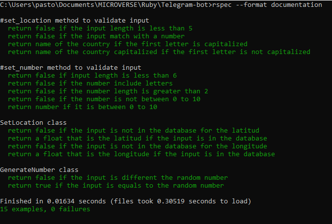

# Telegram bot

This bot is designed to send the loaction of the country that the user tyoe with the command, also it have a guess the number game that It generate a random number between 0 - 10.

## Build With

- Ruby 2.7.1
- Rubocop
- Rspec
- Telegram API

## Clone Repo

To get a local copy and run it:

1.- Open the terminal  
2.- type `git clone https://github.com/pastorp3/Telegram-bot.git` (you must have git installed, if no follow this link https://git-scm.com/book/en/v2/Getting-Started-Installing-Git)

## Installation

In the root  type: 

 `bundle install`
 
 to install the gemfile
 
 Run the bot in the root with:
 
 `Ruby bin/main.rb`
 
 ## Instructions
 
 1.- type /start to start the bot i will return a message with your name  
 2.- type /map 'country' and the bot will send you the location of the country you can click it and open it  
 3.- type /play 'number' ypu have to guess a number between 0 - 10, the bot will tell you if you win or lose  
 4.- type /end the bot will send you a bye message with your name
 
 ## Video Demo
 
 
 
 
 ## Rspec test
 
 Run the test in the root folder with command: 
 `rspec --format documentation`
 
 
 
 ## Authors

👤 **José Pedraza**

- Github: [@pastorp3](https://github.com/pastorp3)
- Twitter: [@jose_pastorp3](https://twitter.com/jose_pastorp3)
- Linkedin: [linkedin](https://www.linkedin.com/in/jos%C3%A9-pedraza-acevedo-ab700a1a9/)

## 🤝 Contributing

Contributions, issues and feature requests are welcome!

Feel free to check the [issues page](https://github.com/pastorp3/Telegram-bot/issues).

## Show your support

Give a ⭐️ if you like this project!

## Acknowledgments

- Hat tip to anyone whose code was used
- Inspiration
- etc

## 📝 License

This project is [MIT](lic.url) licen

 
